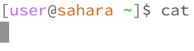
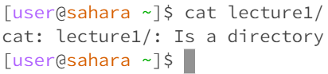
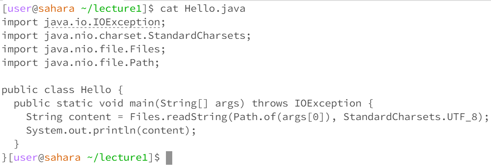

# Lab Report 1: Remote Access and Filesystem (Week 1)

## Commands

### cd

```cd```    
    
Running `cd` with no arguments changes the directory to the home directory. If no argument is provided, `cd` will change directory to home. This output is not an error.

```cd lecture1/```    
  
Running `cd` with a directory as an argument will change the directory to the specified arugment. This output is not an error.

```cd lecture1/Hello.java```    
  
Running `cd` with a file as an argument will result in an error. This error results as we're unable to switch directory into a file. `cd` only works with directories, so a file argument results in an error.

### ls

```ls```  
    
Running `ls` with no arguments lists the files and directories of the current working directory. This output is not an error.

```ls lecture1/```  
  
Running `ls` with a directory as an argument lists the files and directories of the specified directory. This output is not an error.

```ls Hello.class```  
  
Running `ls` with a file as an argument lists out the specified file. This output is not an error.

### cat

```cat```  
  
Running `cat` with no arguments doesn't result in any input(yet). This isn't necessarily an error, as it simply waits until the user types in arguments, as cat expects them.

```cat lecture1/```  
  
Running `cat` with a directory as an argument results in an error. `cat` concatenates and outputs the arguments passed in. However, it can't output the contents of a directory.

```cat Hello.java```  
  
Running `cat` with a file as an argument outputs the contents of the file. This output is not an error.
