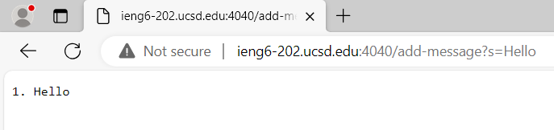
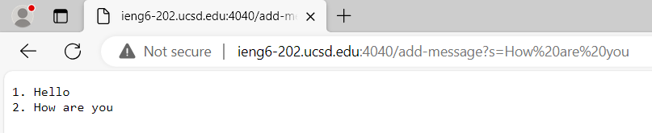
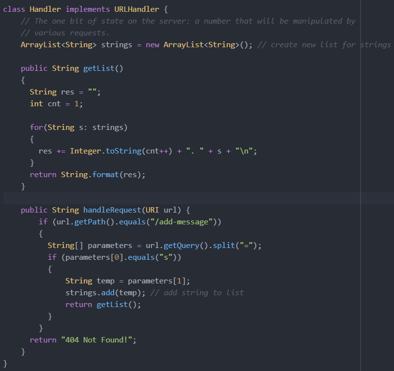

# Lab Report 2: Servers and SSH Keys (Week 3)

## Part 1

```/add-message?s=Hello```    
\   
1. The `main()`, `handleRequest()` and `getList()` methods are called.\
2. `main()` takes in an array of strings, `handleRequest()` takes in a URI and `getList()` doesn't have any parameters. Additionally, there's a string `ArrayList` in the `Handler` class.\
3. The `ArrayList` changes from this request, with "Hello" stored in the first element.\

```/add-message?s=How are you```    
\
1. The `main()`, `handleRequest()` and `getList()` methods are called.\
2. `main()` takes in an array of strings, `handleRequest()` takes in a URI and `getList()` doesn't have any parameters. Additionally, there's a string `ArrayList` in the `Handler` class.\
3. The `ArrayList` changes from this request, with "How are you" being stored in the second element.\

# Code for `StringServer`
\
