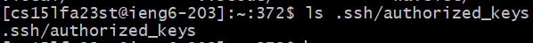

# Lab Report 2: Servers and SSH Keys (Week 3)

## Part 1

```/add-message?s=Hello```    
  
1. The `main()`, `handleRequest()` and `getList()` methods are called.  
2. `main()` takes in an array of strings, `handleRequest()` takes in a URI and `getList()` doesn't have any parameters. Additionally, there's a string `ArrayList` in the `Handler` class.  
3. The `ArrayList` changes from this request, with "Hello" stored in the first element.  

```/add-message?s=How are you```    
  
1. The `main()`, `handleRequest()` and `getList()` methods are called.  
2. `main()` takes in an array of strings, `handleRequest()` takes in a URI and `getList()` doesn't have any parameters. Additionally, there's a string `ArrayList` in the `Handler` class.  
3. The `ArrayList` changes from this request, with "How are you" being stored in the second element.  

### Code for `StringServer`
```
import java.io.IOException;
import java.net.URI;
import java.util.ArrayList;

class Handler implements URLHandler {
    // The one bit of state on the server: a number that will be manipulated by
    // various requests.
    ArrayList<String> strings = new ArrayList<String>(); // create new list for strings

    public String getList()
    {
      String res = "";
      int cnt = 1;

      for(String s: strings)
      {
        res += Integer.toString(cnt++) + ". " + s + "\n";
      }
      return String.format(res);
    }

    public String handleRequest(URI url) {
        if (url.getPath().equals("/add-message"))
        {
          String[] parameters = url.getQuery().split("=");
          if (parameters[0].equals("s"))
          {
              String temp = parameters[1];
              strings.add(temp); // add string to list
              return getList();
          }
        }
      return "404 Not Found!";
    }
}

class StringServer {
    public static void main(String[] args) throws IOException {
        if(args.length == 0){
            System.out.println("Missing port number! Try any number between 1024 to 49151");
            return;
        }

        int port = Integer.parseInt(args[0]);

        Server.start(port, new Handler());
    }
}
```

## Part 2

Path to private key:&nbsp; 
&nbsp;
Path to public key:&nbsp;
&nbsp;
Login without password:&nbsp;
&nbsp;    
