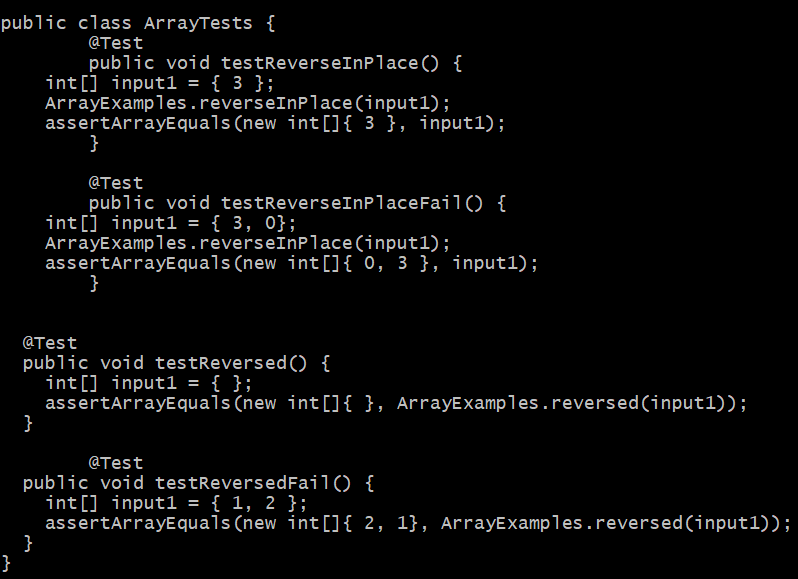
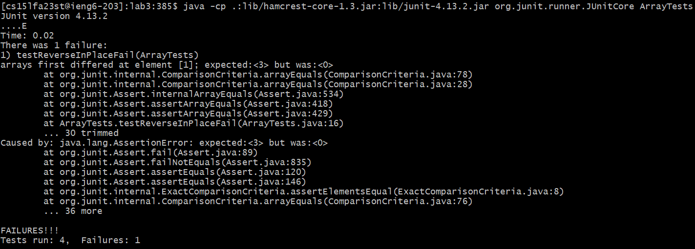
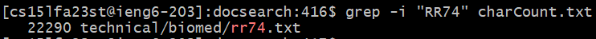
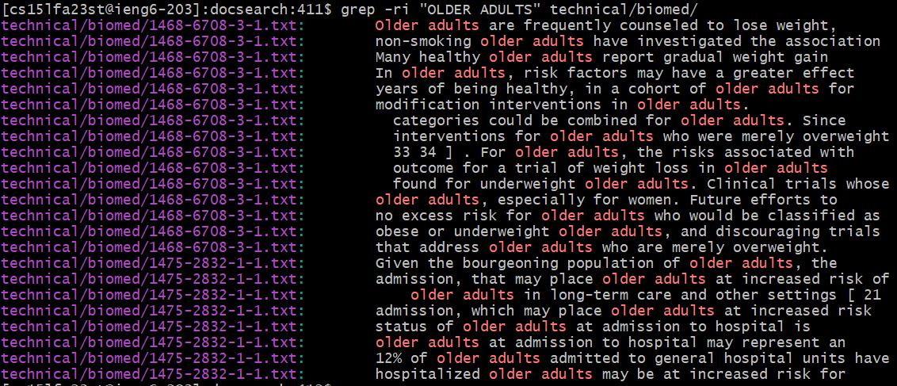
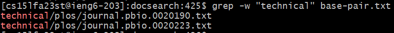
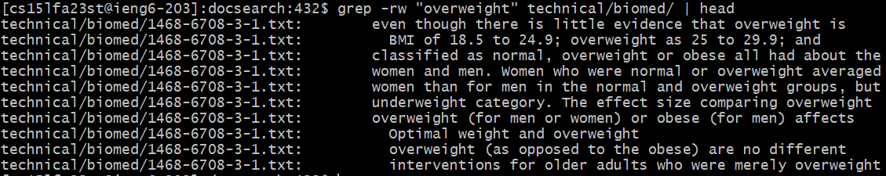
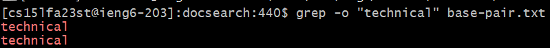
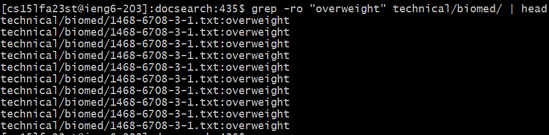
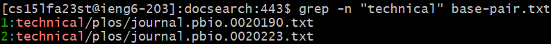
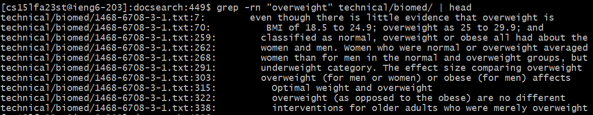

# Lab Report 3: Bugs and Commands

## Part 1: Bugs

Failure-inducing input:  
Associated code:  
```
static void reverseInPlace(int[] arr) {
  for(int i = 0; i < arr.length; i += 1) {
    arr[i] = arr[arr.length - i - 1];
  }
}
```
JUnit Test:  
```
@Test
public void testReverseInPlaceFail() {
  int[] input1 = { 3, 0};
  ArrayExamples.reverseInPlace(input1);
  assertArrayEquals(new int[]{ 0, 3 }, input1);
}
```

Passing input:  
Associated code:  
```
static void reverseInPlace(int[] arr) {
  for(int i = 0; i < arr.length; i += 1) {
    arr[i] = arr[arr.length - i - 1];
  }
}
```
JUnit Test:  
```
@Test
public void testReverseInPlace() {
  int[] input1 = { 3 };
  ArrayExamples.reverseInPlace(input1);
  assertArrayEquals(new int[]{ 3 }, input1);
}
```

Symptom of bug:
Here are the tests in ArrayTests.java. We see that the test that fails is testReverseInPlaceFail(), where the instead of `[0, 3]`, the output is `[3, 0]`.
  
  

Fixing the bug:  
Code before:
```
static void reverseInPlace(int[] arr) {
  for(int i = 0; i < arr.length; i += 1) {
    arr[i] = arr[arr.length - i - 1];
  }
}
```
Code after:
```
static void reverseInPlace(int[] arr) {
  for(int i = 0; i < arr.length/2; i += 1) {
    int temp = arr[i];
    arr[i] = arr[arr.length - i - 1];
    arr[arr.length - i - 1] = temp;
  }
}
```

In order to fix this bug, we only need to traverse through half the array, since we're essentially starting from the left and right edges and working inwards. By the time the  
index reaches the middle of the array, we would've reversed the entire array. Additionally, we need a temporary variable to the value at the index. After we update  
the value at the left index, we can update the right index with this temporary variable.


## Part 2: Researching commands
Let's research the `grep` command.  

### The `-i` option:
The `-i` option allows us to ignore case when searching for a string. This option is useful is we don't care about matching case and want to find all results regardless of the case. 
We can use this option to find a specific string in a file, while ignoring case:
```grep -i "RR74" charCount.txt```
   
We can use this option to find a specific string in a directory, while ignoring case:
```grep -ri "OLDER ADULTS" technical/biomed/```
   

### The `-w` option:
The `-w` option allows us to match whole words instead of substrings, when searching for a string. This option allows us to ensure we only find whole words, instead of the default behavior of finding any matching substring. For example, if we want to find just the string "java", using `-w` allows us to avoid returning any "javascript" results. 
We can use this option to find a specific string in a file, only returning whole word results:
```grep -w "technical" base-pair.txt```
   
We can use this option to find a specific string in a directory, only returning whole word results:
```grep -rw "overweight" technical/biomed/ | head```


### The `-o` option:
The `-o` option allows us to only return the matched strings, when searching for a string. The default results return the entire line which contains the matching string. However, if we only want the matched string in the results, we can use this option.  
We can use this option to find a specific string in a file, only returning matched results:
```grep -o "technical" base-pair.txt```
   
We can use this option to find a specific string in a directory, only returning matched results:
```grep -ro "overweight" technical/biomed/ | head```


### The `-n` option:
The `-n` option allows us to also show the line number of the matched string, when searching for a string. The default results return the entire line which contains the matching string without the line number. However, if we also want to know the line number where the match occurs, we can use this option.  
We can use this option to find a specific string in a file, while also returning the line numbers:
```grep -n "technical" base-pair.txt```
   
We can use this option to find a specific string in a directory, while also returning the line numbers:
```grep -rn "overweight" technical/biomed/ | head```



I used [this article on GeeksforGeeks](https://www.geeksforgeeks.org/grep-command-in-unixlinux/) as a resource for all four command options.
