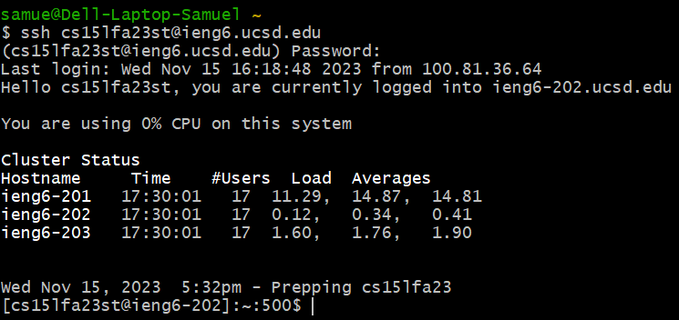
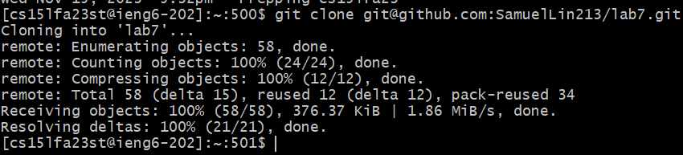
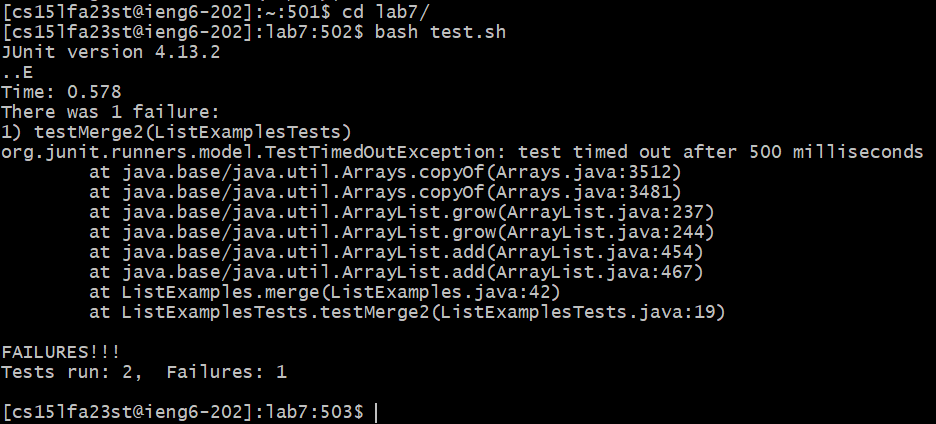
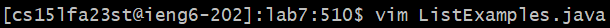
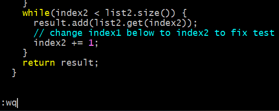
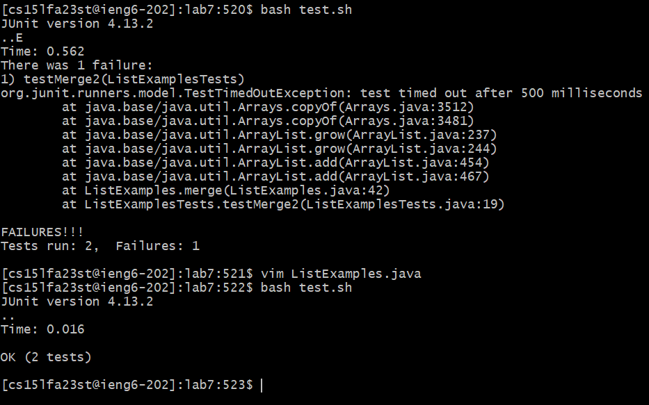
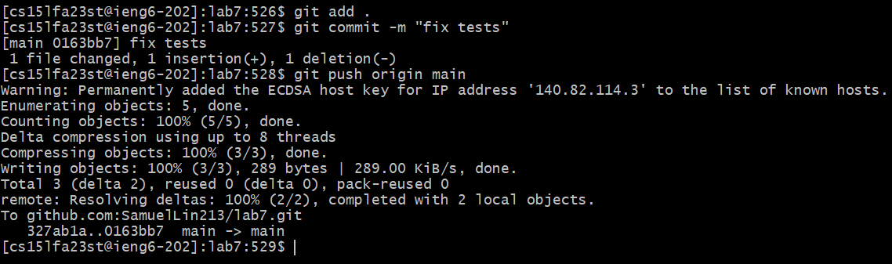

# Lab Report 4: Vim

## Step 4 Logging into ieng6
  
Keys pressed: `ssh cs15lfa23st@ieng6.ucsd.edu`  
To log into the remote server, I use `ssh` with the corresponding server address.  

## Step 5 Cloning the respoitory
  
Keys pressed: `git clone git@github.com:SamuelLin213/lab7.git`  
To clone the repository, I use `git clone` with the `ssh` URL of my forked repository.  

## Step 6 Running the tests, with failing results

Keys pressed: `cd lab7/` and `bash test.sh`  
I `cd` into the `lab7/` folder, and then run the tests using the `test.sh` script. The second test fails. 

## Step 7 Editing the code file to pass the tests

Keys pressed: `vim Li<tab>.java` and `?index1<enter>er2:wq<enter>`
I then open the `.java` file in `vim`. I use the tab completion to open the file faster. Inside `vim`, I use the following keystrokes to update the code:  
* `?index1<enter>`: this finds the first occurence of `index1` backwards
*  `e`: this jumps to the end of `index1`
*  `r2`: this updates `index1` to `index2`
*  `:wq`: this saves the code file and exits back to the terminal

## Step 8 Rerunning the tests, with passing results

Keys pressed: `<up><up><enter>`
The `bash test.sh` command was 2 up in the command history, so I used the up arrow twice to access it. 

## Step 9 Pushing to Github

Keys pressed: `git add .`, `git commit -m "fix tests"` and `git push origin main`
After fixing the code file to pass the tests, I use `add`, `commit` and `push` commands to push the code to Github.
