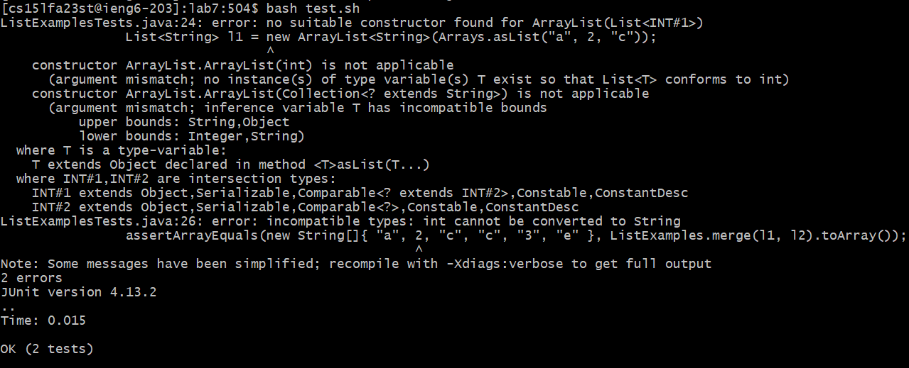
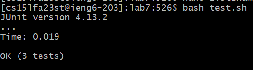
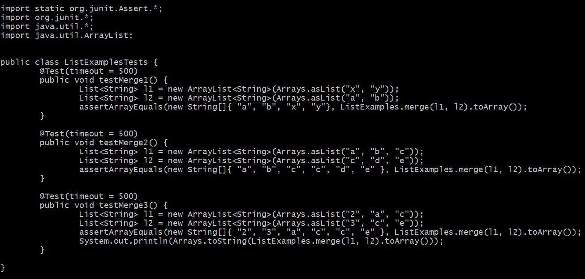

# Lab Report 5: Putting it all Together

## Part 1: Debugging Scenario
[Student]: I'm running my program and have this error when I run the bash script. What am I doing wrong?
  

[TA]: It looks like you're attempting to test arrays with mixed datatypes. It's possible you're thinking of a capability that Python has. Unfortunately, Java can't have multiple datatypes in an array if you explicitly declare its type as String. You could try a workaround, such as setting the datatype to object. However, this doesn't align with the program's purpose of merging and filtering string arrays. I would suggest trying another test case, and to not factor this edge case of arrays with multiple datatypes.   

[Student]: Thank you for the help! I edited the test accordingly, so that it only contains string values, and was able to pass the test.  
  
Here is what my tests file looks like now. 
  

### Set-up
File structure:  
|-ListExamples.java
|-ListExamplesTests.java
|-StringChecker.class
|-test.sh
Contents of test file before fixing the bug:
  
Command Line to trigger bug:  
```bash test.sh```
Description on how to fix bug:   
The student was attempting to test an edge case where the array passed in contains multiple datatypes. It's also possible they forgot the quotes around the numbers. To fix the bug, simply convert the numbers to string and ensure the numbers are in the right order in each input string (before any letters).

## Part 2:
I think one of the more interesting topics we discussed in the second half of the quarter were the labs on scripting and how it applies to autograders. I've worked with make files when developing C++ programs in the past, so the idea of creating a bash script to run and test the program was somewhat familiar. The labs on writing the autograder provides an interesting perspective on what autograders like Gradescope might be doing under the hood when grading code files. I really enjoyed learning about scripting, and how it can help immensely with debugging and running programs; instead of remembering and running the long javac commands everytime, we can simply run the bash script, which can be customized to our specific needs. 
